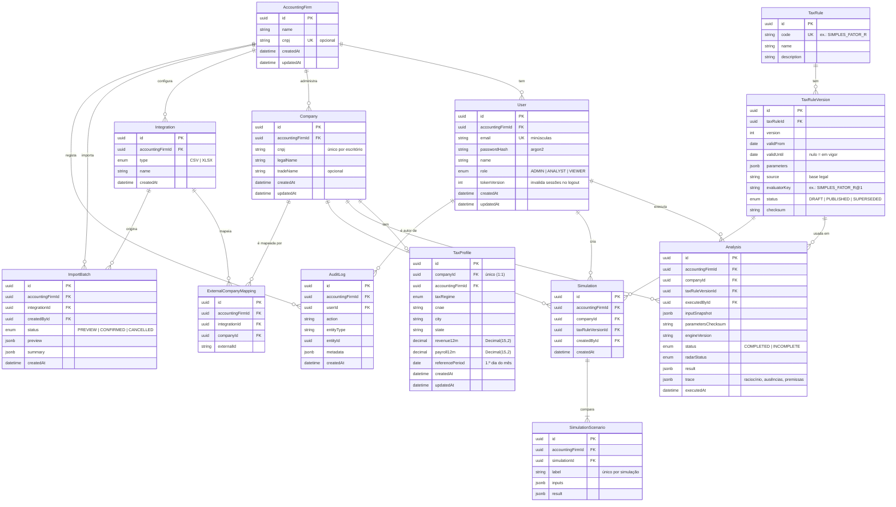

# Modelo de dados (diagrama ER)

Modelo relacional planeado para o MVP em PostgreSQL, derivado do [relatório técnico §4](arquitetura-e-decisoes.md#4-modelo-de-dados). A justificação da tecnologia está no [ADR 0001](adr/0001-postgresql-prisma.md).

As tabelas são criadas incrementalmente, via Prisma Migrate, na semana em que cada funcionalidade é implementada (ver [cronograma](arquitetura-e-decisoes.md#8-cronograma-8-semanas-semana-0--2026-09-26)). Este diagrama é o alvo; os nomes finais das colunas podem ajustar-se na implementação.

## Diagrama

## Restrições e índices

| Tabela | Restrição / índice | Motivo |
|---|---|---|
| User | `email` único; único `(id, accountingFirmId)`; índice `accountingFirmId` | Login por email; alvo das FKs compostas de Analysis, Simulation, AuditLog e ImportBatch; listagem por escritório |
| Company | únicos `(accountingFirmId, cnpj)` e `(id, accountingFirmId)`; índice `(accountingFirmId, legalName)` | CNPJ não repete dentro do escritório; o par `(id, accountingFirmId)` é alvo das FKs compostas |
| TaxProfile | único `(companyId, accountingFirmId)` (um perfil por empresa); FK composta → Company; `CHECK` valores ≥ 0; campos tributários anuláveis | Um perfil por empresa, do mesmo tenant; nulo = dado ausente, distinto de zero (D20) |
| TaxRule | `code` único | Catálogo global de regras |
| TaxRuleVersion | único `(taxRuleId, version)`; `CHECK validUntil > validFrom`; `EXCLUDE` sobreposição de vigência | Só uma versão vigente por período |
| Analysis | FKs compostas → Company e User; índices `(accountingFirmId, companyId, executedAt DESC)` e `(accountingFirmId, radarStatus)` | Histórico por empresa; filtros do Radar |
| Simulation | FKs compostas → Company e User; único `(id, accountingFirmId)` | Isolamento entre tenants; alvo da FK composta de SimulationScenario |
| SimulationScenario | FK composta → Simulation; único `(simulationId, label)` | Cenários com nome distinto, do mesmo tenant da simulação |
| AuditLog | apenas inserção (append-only); FK composta → User; índice `(accountingFirmId, createdAt DESC)` | Trilho de auditoria imutável |
| Integration | únicos `(accountingFirmId, type, name)` e `(id, accountingFirmId)` | Integrações nomeadas por escritório; alvo das FKs compostas |
| ExternalCompanyMapping | FKs compostas → Integration e Company; únicos `(integrationId, externalId)` e `(integrationId, companyId)` | IDs externos ficam fora de `Company` |
| ImportBatch | FKs compostas → Integration e User; índice `(accountingFirmId, createdAt DESC)` | Histórico de importações |

**FK composta (decisão D15):** toda FK entre tabelas do tenant inclui o escritório, por exemplo `(companyId, accountingFirmId)` → `Company(id, accountingFirmId)`. Por isso as tabelas que são pai (Company, User, Simulation, Integration) têm único `(id, accountingFirmId)`. Assim o banco rejeita qualquer registo que ligue um escritório a dados de outro. As FKs para o catálogo global (`TaxRuleVersion`) são simples. As regras completas estão em [seguranca.md](seguranca.md#schema-d15).

## Convenções

- IDs `UUID`.
- Valores monetários em `Decimal(15,2)`.
- Toda entidade do tenant tem `accountingFirmId`, incluindo as tabelas filhas (D15); `TaxRule` e `TaxRuleVersion` são catálogo global.
- `Analysis` é imutável: uma nova execução cria um novo registo.
- `AnalysisInput` da especificação é guardado como `inputSnapshot` (JSONB) em `Analysis` (decisão D6).
- O estado do Tax Radar é derivado (não é tabela); `Analysis.radarStatus` guarda o estado calculado em cada execução.
